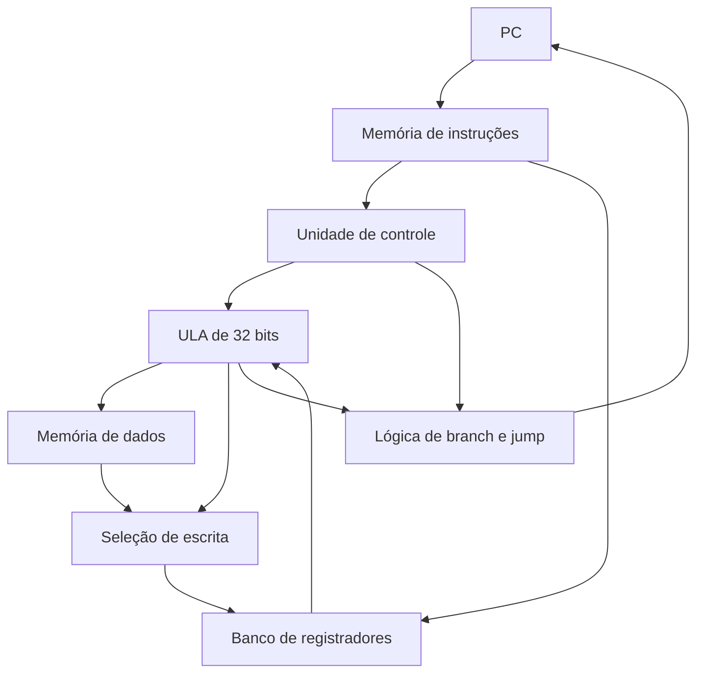

# Processador MIPS em VHDL

Implementação didática de um processador MIPS monociclo simplificado, desenvolvida
em VHDL. O projeto apresenta de forma modular o caminho de dados e as unidades de
controle necessárias para executar um subconjunto da arquitetura MIPS.

O processador foi validado com um programa que calcula os dez primeiros valores da
sequência de Fibonacci e os armazena na memória de dados.

## Funcionalidades

- caminho de dados de 32 bits;
- banco com 32 registradores de 32 bits;
- registrador `$zero` permanentemente fixado em zero;
- ULA estrutural formada por 32 ULAs de 1 bit;
- memória de instruções com o programa de teste;
- memória de dados com interface de depuração;
- suporte a desvios condicionais e saltos;
- sinais internos `ds1` a `ds30` disponíveis para acompanhamento no testbench.

## Instruções implementadas

| Formato | Instrução | Operação |
| ------- | --------- | -------- |
| R | `add` | Soma dois registradores |
| R | `sub` | Subtrai dois registradores |
| R | `and` | AND bit a bit |
| R | `or` | OR bit a bit |
| R | `nor` | NOR bit a bit |
| R | `slt` | Define o destino como 1 se o primeiro operando for menor |
| I | `addi` | Soma um registrador e uma constante |
| I | `lw` | Carrega uma palavra da memória |
| I | `sw` | Armazena uma palavra na memória |
| I | `beq` | Desvia quando os registradores são iguais |
| J | `j` | Realiza um salto incondicional |

## Visão geral do caminho de dados



## Organização do projeto

| Arquivos | Responsabilidade |
| -------- | ---------------- |
| `mips.vhd` | Integração do caminho de dados e dos sinais de controle |
| `UnidadeControle.vhd` | Decodificação do opcode e geração dos sinais principais |
| `ULA_Controle.vhd` | Seleção da operação da ULA a partir de `ALUOp` e `funct` |
| `ula32bits.vhd`, `ULA1b.vhd` | Operações aritméticas, lógicas e comparação |
| `banco_de_registradores.vhd` | Leitura e escrita dos 32 registradores |
| `Registrador.vhd`, `registradorPC.vhd` | Armazenamento de palavras e controle do PC |
| `memInstrucoes.vhd`, `memDados.vhd` | Memórias de instruções e dados |
| `mux*.vhd` | Multiplexadores usados no caminho de dados |
| `somador.vhd`, `somador32.vhd` | Somadores de 1 e 32 bits |
| `decodificador*.vhd` | Seleção do registrador de destino da escrita |
| `extensor.vhd` | Extensão de sinal do imediato de 16 para 32 bits |
| `deslocador*.vhd` | Deslocamentos usados em branch e jump |
| `tipo.vhd` | Tipos auxiliares compartilhados entre os módulos |
| `mips_tb.vhd` | Testbench completo do processador |

## Programa de teste

A memória de instruções contém um programa MIPS que produz a sequência:

```text
1, 1, 2, 3, 5, 8, 13, 21, 34, 55
```

O testbench inicializa o PC em `0x00400000`, executa 50 ciclos de clock e lê as
primeiras posições da memória de dados por meio dos sinais `DebugEndereco` e
`DebugPalavra`.

Durante a simulação, os valores dos sinais `ds1` a `ds30` são escritos no console,
permitindo acompanhar cada etapa do caminho de dados.

## Como simular com GHDL

### Requisitos

- [GHDL](https://github.com/ghdl/ghdl);
- terminal compatível com Bash.

Na raiz do projeto, execute:

```bash
chmod +x simular_ghdl.sh
./simular_ghdl.sh
```

O script analisa os arquivos na ordem correta, elabora a entidade `mips_tb` e
executa a simulação durante 620 ns.

## Como abrir no Xilinx ISE

1. Abra o arquivo `processador.xise`.
2. Confirme `mips` como módulo principal de implementação.
3. Selecione `mips_tb` como módulo principal de simulação.
4. Execute a simulação comportamental.

## Sinais de depuração

| Sinal | Conteúdo |
| ----- | -------- |
| `ds1` | Valor atual do PC |
| `ds2` | Instrução lida |
| `ds3` a `ds6` | Seleção e escrita no banco de registradores |
| `ds7` a `ds17` | Operandos, controle e resultado da ULA |
| `ds18` a `ds21` | Controle e acesso à memória de dados |
| `ds22` a `ds30` | Cálculo do próximo PC, branch e jump |

A correspondência detalhada de cada sinal pode ser consultada diretamente nas
atribuições ao final de `mips.vhd` e nos cabeçalhos produzidos por `mips_tb.vhd`.

## Autores

- **Pedro Arthur Luz Guimarães** — [Pedroarthurlg](https://github.com/Pedroarthurlg)
- **João Victor Guilherme Ribeiro** — [nw-11](https://github.com/nw-11)

Projeto desenvolvido para fins acadêmicos na Universidade Federal de São João
del-Rei (UFSJ).
